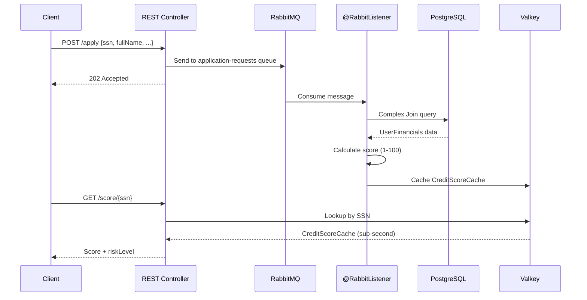

# Global Credit Scoring Engine - Walkthrough

## Summary

Successfully created a **Spring Boot 3.x Maven project** demonstrating the "Data Hub" architecture for Tanzu Experience Day. The application integrates PostgreSQL, RabbitMQ, and Valkey.

## Project Structure

```
global-credit-engine/
├── pom.xml                    # Maven build with all dependencies
├── manifest.yml               # Cloud Foundry deployment config
├── README.md                  # Comprehensive documentation
└── src/main/java/com/tanzu/creditengine/
    ├── GlobalCreditEngineApplication.java
    ├── config/
    │   └── RabbitMQConfig.java
    ├── entity/
    │   ├── UserFinancials.java      # JPA Entity (PostgreSQL)
    │   └── CreditScoreCache.java    # Valkey/Redis model
    ├── repository/
    │   ├── UserFinancialsRepository.java
    │   └── CreditScoreCacheRepository.java
    ├── service/
    │   ├── CreditApplicationService.java
    │   └── CreditScoreCalculator.java
    ├── messaging/
    │   ├── CreditApplicationMessage.java
    │   └── CreditApplicationListener.java
    └── controller/
        └── CreditApplicationController.java
```

## Key Components Created

### Data Layer
| File | Purpose |
|------|---------|
| [UserFinancials.java](src/main/java/com/tanzu/creditengine/entity/UserFinancials.java) | JPA Entity with SSN, creditHistoryScore, criminalRecord, riskLevel |
| [CreditScoreCache.java](src/main/java/com/tanzu/creditengine/entity/CreditScoreCache.java) | Valkey/Redis Hash for cached scores |

### Messaging
| File | Purpose |
|------|---------|
| [RabbitMQConfig.java](src/main/java/com/tanzu/creditengine/config/RabbitMQConfig.java) | Queue definition for `application-requests` |
| [CreditApplicationListener.java](src/main/java/com/tanzu/creditengine/messaging/CreditApplicationListener.java) | @RabbitListener that processes applications |

### REST API
| Endpoint | Method | Description |
|----------|--------|-------------|
| `/api/apply` | POST | Submits credit application to RabbitMQ queue |
| `/api/score/{ssn}` | GET | Retrieves cached score from Valkey |
| `/api/health` | GET | Health check endpoint |

### Cloud Foundry
| File | Services Bound |
|------|----------------|
| [manifest.yml](manifest.yml) | `credit-db` (PostgreSQL), `credit-msg` (RabbitMQ), `credit-cache` (Valkey) |

## The Data Hub Workflow



## Verification

> [!NOTE]
> Local compilation requires Java 17+. The development environment has Java 11, but Cloud Foundry will use Java 17 as specified in the manifest.

**To build on CF or with Java 17:**
```bash
mvn clean package
cf push
```

## Documentation

The [README.md](README.md) includes:
- Architecture diagram
- Deployment instructions
- API usage examples with curl commands
- Local development setup
- Credit score algorithm explanation
